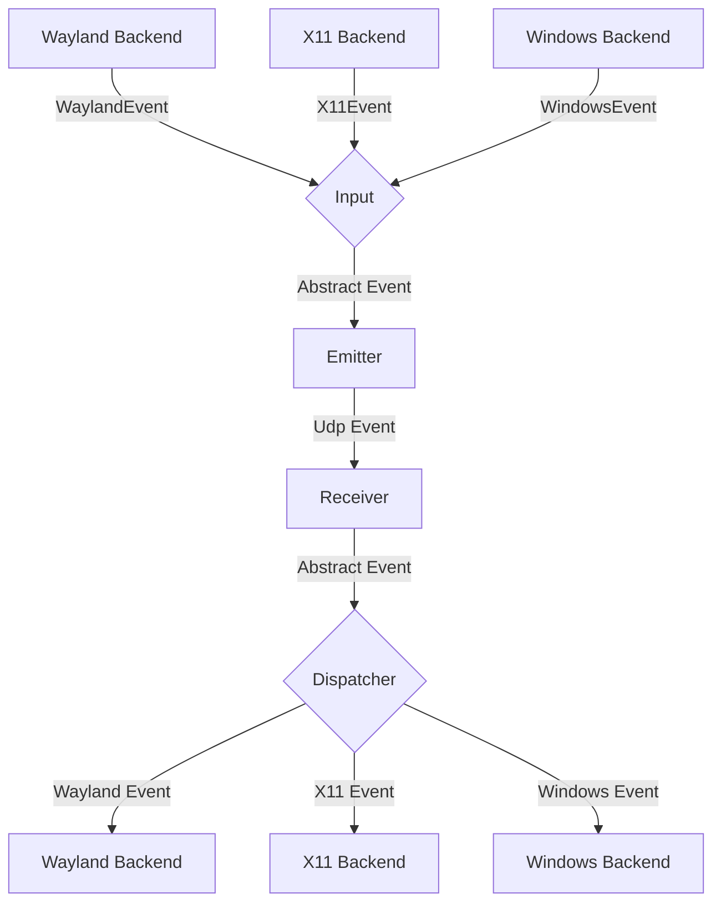
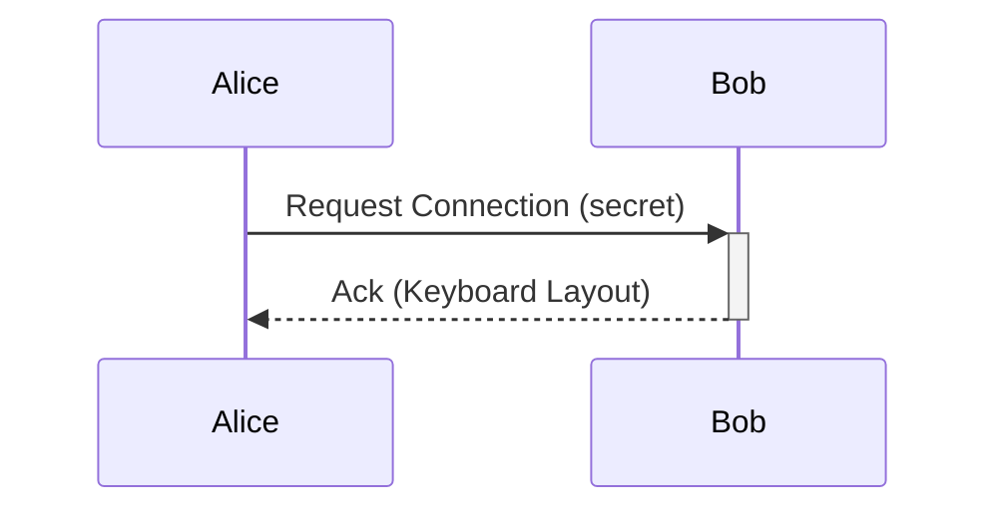

# DeskUnify 双机键鼠实测

三种组合均使用下面的配置：macOS ↔ macOS、Windows ↔ Windows、Windows ↔ macOS。每轮先使用一个实体键鼠来源，随后换另一台作为来源重复测试。文本剪贴板同步已接入 daemon，启用方法见下文；三种组合仍需真机验证。

## 构建与启动

在每台电脑的仓库根目录执行：

```sh
cargo build -p lan-mouse --no-default-features --locked
```

macOS 二进制是 `target/debug/lan-mouse`，Windows 是 `target/debug/lan-mouse.exe`。以下示例使用 macOS 路径；Windows PowerShell 中替换成 `./target/debug/lan-mouse.exe`。

macOS 需要在系统设置的隐私与安全性中授予启动程序所需的辅助功能、输入监控权限，然后重新启动 daemon。CLI 版本静默检查权限；日志必须显示使用 `macos` capture/emulation 后端，使用 `dummy` 后端不算真机测试通过。Windows 日志应显示 `windows` 后端。两端防火墙允许配置端口的 UDP 流量，默认端口为 4242；当前输入传输使用 DTLS/UDP。启用剪贴板时还需允许同端口号的 TCP 流量。

新建 `machine-a.toml` 和 `machine-b.toml`。下面假设 A 在左、B 在右，A 的 IP 是 `192.168.1.10`，B 是 `192.168.1.11`；替换为实际局域网 IP。

A 的配置：

```toml
port = 4242

[[clients]]
ips = ["192.168.1.11"]
position = "right"
activate_on_startup = true
```

B 的配置：

```toml
port = 4242

[[clients]]
ips = ["192.168.1.10"]
position = "left"
activate_on_startup = true
```

上下排列则分别设置 `bottom` 和 `top`。每台配置里填写的是对方的 IP 和对方相对本机的位置。

A 启动命令如下，B 换成 `machine-b.toml`。保持此终端运行：

```sh
./target/debug/lan-mouse --config ./machine-a.toml daemon
```

默认紧急释放组合为左侧 Ctrl + Shift + Alt/Option + Windows/Command 四个修饰键，同时按下恢复本机控制。可用配置中的 `release_bind` 自定义；第一次跨屏前确认日志中打印的组合。

## CLI 启动、扫描与配置

配对后文字和文件剪贴板由 daemon 自动运行，不要求键鼠权限；独立 `files` 命令仍保留，见 [文件传输](#文件传输)。

默认构建不启用 GUI。无子命令或 `daemon` 都在前台运行后台；另开终端控制它。不要继续使用旧 GUI 启动的后台：先退出旧版本，再运行同版本 CLI/daemon。本地 IPC crate 为 0.6.0，协议为 7；键鼠 DTLS 事件格式未改变，新增独立配对/策略协商协议 `deskunify-control/1`（TCP：输入端口 + 2）。macOS/Windows 两端都需新版；Linux 保留原输入流程。

```sh
./target/debug/lan-mouse daemon
```

另一个终端：

```sh
./target/debug/lan-mouse cli status
./target/debug/lan-mouse cli permissions
./target/debug/lan-mouse cli scan --wait 5
./target/debug/lan-mouse cli fingerprint
```

扫描采用 Rust mDNS，服务类型为 `_lanbridge._udp.local.`，无需 `dns-sd`。它只发现运行 DeskUnify 的其他设备，并过滤本机指纹；不会列出所有局域网电脑。另一台必须运行 daemon、启用发现、允许 UDP 5353 和本地网络访问。同一 Wi-Fi 的访客隔离、不同 VLAN 或禁用多播也可能阻止发现。配置中的顶层 `discovery = false` 会明确拒绝扫描；可删除该覆盖或改成 `true`。名称、IP、端口和指纹来自公告，公告本身不授予信任。

在对方终端读取其完整 SHA-256 指纹并核对后配对。以设备 A `192.168.1.10` 在左、B `192.168.1.11` 在右为例：

```sh
# A 上使用 B 的实际指纹
./target/debug/lan-mouse cli pair --fingerprint "B的完整指纹" --position right
# B 上使用 A 的实际指纹
./target/debug/lan-mouse cli pair --fingerprint "A的完整指纹" --position left
```

`pair` 使用扫描结果的地址、端口和指纹，发起双向配对；B 用 GUI「允许配对」或 `cli authorize "设备 A" "A 指纹"` 确认后自动生成反向设备。按证书身份复用已有配置；已配置同一地址/端口时 CLI 会提示已有设备，旧条目可在双方授权后通过发现结果绑定指纹。默认端口 4242。无法多播发现时手工添加并授权：

```sh
# A 上
./target/debug/lan-mouse cli add-client --ips 192.168.1.11 --position right --fingerprint "B的完整指纹"
# B 上
./target/debug/lan-mouse cli add-client --ips 192.168.1.10 --position left --fingerprint "A的完整指纹"
```

`--hostname` 可选；`--ips` 支持多个地址（空格或逗号分隔）。可以先添加地址，再用 `cli authorize-key 描述 "完整指纹"` 授权。默认身份文件为 macOS 的 `~/.config/lan-mouse/lan-mouse.pem` 或 Windows 的 `%LOCALAPPDATA%\lan-mouse\lan-mouse.pem`；重启沿用该身份。不要复制私钥到另一台电脑。`--config` 更改配置位置；独立身份需额外指定 `--cert-path`。

先 `cli list` 获取本次后台的设备 ID；ID 重启后可能变化。下例中的 `0` 需替换为实际 ID：

```sh
./target/debug/lan-mouse cli set-position 0 right
./target/debug/lan-mouse cli set-ips 0 192.168.1.11
./target/debug/lan-mouse cli set-port 0 4242
./target/debug/lan-mouse cli set-host 0 machine-b.local
./target/debug/lan-mouse cli set-host 0                 # 清除 hostname，需保留 IP
./target/debug/lan-mouse cli deactivate 0
./target/debug/lan-mouse cli activate 0
./target/debug/lan-mouse cli set-hooks 0 --enter-hook 'echo entered' --leave-hook 'echo left'
./target/debug/lan-mouse cli set-hooks 0                # 清除两个 hook
./target/debug/lan-mouse cli settings --port 4242
./target/debug/lan-mouse cli clipboard true
./target/debug/lan-mouse cli clipboard false
./target/debug/lan-mouse cli authorized
./target/debug/lan-mouse cli remove-authorized-key "对端完整指纹"
./target/debug/lan-mouse cli remove-client 0
./target/debug/lan-mouse cli save-config
```

配置和授权操作收到后台确认后自动保存到 `cli status` 显示的配置路径；保存失败返回非零退出码并明确提示“已应用但保存失败”。`set-port` 改的是单个对端端口，`settings --port` 改的是本机监听端口。启用设备移到已占用边缘会交换两个边缘；更改停用设备的位置保持它停用。同一边缘只启用一个发送目标。删除设备配置不会同时撤销其身份授权；需要另外执行 `remove-authorized-key`。

```sh
./target/debug/lan-mouse cli doctor --local
./target/debug/lan-mouse cli doctor
./target/debug/lan-mouse cli retry-backends --wait 3
./target/debug/lan-mouse cli pause
./target/debug/lan-mouse cli resume
./target/debug/lan-mouse cli release
./target/debug/lan-mouse cli shutdown
```

`doctor --local` 检查两个原生输入后端与暂停状态；`doctor` 还要求存在已连接的启用设备。不具备条件时返回非零退出码。dummy 永远不能通过真实键鼠就绪检查。就绪检查不能替代实际跨屏测试。`retry-backends`（兼容旧名称 `enable-capture`/`enable-emulation`）重试两个后端并等待结果。`pause` 暂停输入发送/接收及文本剪贴板，释放模拟按键和按钮；`resume` 恢复。`release` 立即返回本机；`shutdown` 正常退出并释放输入状态。

macOS CLI 在启动时只检查权限。若报辅助功能或输入监控错误，需授权启动它的终端 App（Terminal/iTerm 等），而不是只授权先前的 GUI 应用。由用户运行以下命令显式发起权限请求或打开对应设置：

```sh
./target/debug/lan-mouse cli permissions --request
./target/debug/lan-mouse cli permissions --open accessibility
./target/debug/lan-mouse cli permissions --open input-monitoring
./target/debug/lan-mouse cli permissions --open local-network
```

首次请求辅助功能；授权并重新启动终端后再次请求输入监控/输入控制。用户完成系统授权，再重启 daemon。`permissions` 检查当前 CLI 进程，后台的实际可用性以 `status`/`doctor` 为准。

所有控制命令支持 `cli --json ...`，正常输出为 JSON，错误通过 stderr 和非零退出码报告；`cli --timeout 10 ...` 设置单次后台确认时限（1–120 秒）。断开连接不算成功；超时可能意味着操作已应用但回执未到达，应先查询 `status`。不同 IPC 版本在修改配置前拒绝操作。

## macOS 免 Rust 运行包

先构建 CLI release，再从仓库根目录打包：

```sh
cargo build -p lan-mouse --no-default-features --release --locked
python3 scripts/package-cli.py target/release/lan-mouse --arch AppleSilicon
# 在 Apple Silicon 上交叉编译 Intel：
rustup target add x86_64-apple-darwin
cargo build -p lan-mouse --no-default-features --release --target x86_64-apple-darwin --locked
python3 scripts/package-cli.py target/x86_64-apple-darwin/release/lan-mouse --arch Intel --position left
```

对应 ZIP 位于 `target/DeskUnify-CLI-macos-AppleSilicon.zip` / `target/DeskUnify-CLI-macos-Intel.zip`。解压到对应架构的 Mac；`permissions.command` 显式请求终端权限，`start.command` 在 Terminal 前台启动后台，`status.command` 显示状态/公开指纹/诊断，`scan.command` 扫描，`stop.command` 正常停止。直接 CLI 命令使用该目录下的 `lan-mouse`。脚本不随包复制身份文件；证书在各台机器首次启动时单独生成。

打包可显式传入 `--peer-ip`、`--peer-fingerprint` 和 `--position`，生成填好可信公开身份的 `pair-with-main.command`。该脚本只供收到包的用户自行核对并执行一次；不会在启动时自动授权。两端仍需互相授权。程序仅使用系统动态库，本地临时签名，未做 Apple 公证；真实 Intel Mac 的原生权限和输入仍需测试，Rosetta 验收不能替代它。

## 独立输入诊断

先停止 daemon，避免同时注册输入后端。`test-capture --seconds 15` 捕获并打印事件，在 Escape、Ctrl+C 或时限结束时释放捕获并退出。`test-emulation` 必须选择至少一种事件，现已实际遵循各旗标：`--mouse` 移动并单次点击，`--keyboard` 向当前焦点应用输入一次 A，`--scroll` 发送滚轮。默认 5 秒，`--seconds` 可设 1–300 秒；退出或消费事件出错时仍执行清理。

```sh
./target/debug/lan-mouse test-capture --seconds 15
./target/debug/lan-mouse test-emulation --mouse --scroll --seconds 5
```

开发验收使用显式 dummy，既不注册原生输入后端，也不访问系统剪贴板：

```sh
python3 scripts/test-cli.py target/debug/lan-mouse
```

脚本启动两个临时后台，执行真实 CLI 命令，验证 mDNS 扫描、完整指纹配对、双向 DTLS 键鼠事件、配置/授权保存与重启、hook、暂停释放修饰键、恢复连接、端口公告更新和正常退出。它在暂停状态验证剪贴板设置开关；剪贴板数据传输由使用模拟剪贴板的 Rust TLS 测试覆盖。Unix `LAN_MOUSE_IPC_SOCKET` 提供隔离 IPC；`LAN_MOUSE_DUMMY_TEST_EVENTS=1` 使 dummy 以 100 毫秒间隔循环键盘、按钮、滚轮与移动测试事件，正常 dummy 保留移动轨迹。该测试变量仅用于两个后端均明确配置为 dummy 的隔离测试。Windows 构建与核心测试由 CI 配置覆盖，尚未在 Windows 真机运行。

## 按设备共享与复制粘贴

macOS/Windows 新配对的四项开关默认开启：鼠标（移动/按钮/滚轮）、键盘（含修饰键）、文字剪贴板、文件剪贴板。两端分别保存偏好，实际允许的功能取双方交集。停用设备、全局暂停、撤销授权或失去协商连接时停止对应共享；停用后重连不自动启用。切换开关会释放该设备持有的按键/鼠标按钮，不影响其他设备。macOS/Windows 关闭键盘共享时本机键盘继续正常输入。

```sh
./target/debug/lan-mouse cli list
./target/debug/lan-mouse cli sharing 0
./target/debug/lan-mouse cli sharing 0 --mouse true --keyboard false --clipboard true --files true
./target/debug/lan-mouse cli file-directory "$HOME/Downloads/DeskUnify"
```

`id` 为 `cli list` 中的本机句柄，实际身份按证书指纹保存。新 TOML 客户端支持 `fingerprint` 与 `sharing = { mouse = true, keyboard = true, clipboard = true, files = true }`。旧的明确 `clipboard = false` 保留为旧设备的文字关闭偏好；新配对仍四项默认开启。已授权旧设备通过 mDNS 的地址/端口匹配迁移，随后以 TLS 指纹验证；无法匹配时重新扫描配对，不从 IP 猜身份。

复制粘贴只跟随当前键鼠控制的设备，回到本机保留最近目标；最近目标按指纹保存，重启不会按句柄误选。仅有一台已配对设备时以它为初始目标。目标不可用时不自动换成另一台。进入本机的已配对控制连接也将对端设为最近目标，以支持反向复制粘贴。

纯文本仍使用双向认证 TLS；空文本、中文、Emoji、多行与 1 MiB 上限保持原规则。首次开启仅建立本机剪贴板基线，不把旧内容主动发给别人；换目标也不重播之前复制的文字。文件复制后预传，校验落盘完成后可粘贴；复制其他内容取消未完成的自动发送，远端剪贴板写入带防回传标记。传输中换目标仍发送给原收件人；暂停、停用、授权撤销或文件开关关闭会取消，重新复制可续传。

默认端口：UDP 4242 键鼠，TCP 4242 文字，TCP 4243 文件，TCP 4244 配对协商，UDP 5353 发现。非默认输入端口 P 对应文件 P+1、协商 P+2，P 范围 1–65533。任一端旧程序不支持协商时，GUI 显示等待/失败，不把开关「开启」宣称成可用。B 需运行后台并确认一次配对，之后不必再次连接 A。关闭 GUI 后 daemon 继续共享，`cli shutdown` 或 GUI「退出后台」结束。

## 键鼠验收记录

Mac ↔ Mac 验收前，在双方“系统设置 → 显示器 → 高级”关闭“允许指针和键盘在附近的 Mac 或 iPad 之间移动”（苹果通用控制），以便将实际跨屏效果明确归因于 DeskUnify。设置入口见 [Apple 官方说明](https://support.apple.com/zh-cn/102459)。

每种组合、每个控制方向分别记录系统版本、构建提交、IP、显示器排列、缩放比例和结果：

- 跨配置边缘进入对端，再移回边缘返回；连续切换 20 次。
- 验证左右键、中键、滚轮、按住鼠标拖动和键盘输入。
- 验证 Shift、Ctrl、Alt/Option、Windows/Command 的按下、组合与释放；跨系统按键映射以实际结果记录，待验证后确定映射策略。
- 中文输入法、英文、标点和 emoji 输入；键盘输入与文本剪贴板同步分别验证。
- 远端控制期间按紧急释放组合，确认本机键鼠恢复且对端没有残留修饰键。
- 按住 Shift/Ctrl 时断开网络或退出来源程序，确认对端释放按键；重连后再次跨屏。
- 休眠唤醒后再次跨屏；多屏、Retina/不同缩放比例分别重复。
- 未授权设备连接不能产生输入；移除授权后记录当前会话和后续新连接的行为。

自动检查不替代以上真机步骤。本机构建可使用：

```sh
cargo fmt --all --check
cargo test --workspace --exclude lan-mouse-gtk --no-default-features --locked
cargo clippy --workspace --exclude lan-mouse-gtk --no-default-features --all-targets --locked -- -D warnings
```

`.github/workflows/core.yml` 在 Windows、Apple Silicon macOS、Intel macOS 上执行上述核心检查及构建。完整 GTK 检查需要 GTK/libadwaita 开发依赖；原上游工作流已归档到 `docs/upstream/rust.yml`。

---

# General Software Architecture

## Events

Each instance of lan-mouse can emit and receive events, where
an event is either a mouse or keyboard event for now.

The general Architecture is shown in the following flow chart:


### Input
The input component is responsible for translating inputs from a given backend
to a standardized format and passing them to the event emitter.

### Emitter
The event emitter serializes events and sends them over the network
to the correct client.

### Receiver
The receiver receives events over the network and deserializes them into
the standardized event format.

### Dispatcher
The dispatcher component takes events from the event receiver and passes them
to the correct backend corresponding to the type of client.


## Requests

// TODO this currently works differently

Aside from events, requests can be sent via a simple protocol.
For this, a simple tcp server is listening on the same port as the udp
event receiver and accepts requests for connecting to a device or to
request the keymap of a device.



## Problems
The general Idea is to have a bidirectional connection by default, meaning
any connected device can not only receive events but also send events back.

This way when connecting e.g. a PC to a Laptop, either device can be used
to control the other.

It needs to be ensured, that whenever a device is controlled the controlled
device does not transmit the events back to the original sender.
Otherwise events are multiplied and either one of the instances crashes.

To keep the implementation of input backends simple this needs to be handled
on the server level.

## Device State - Active and Inactive
To solve this problem, each device can be in exactly two states:

Either events are sent or received.

This ensures that
- a) Events can never result in a feedback loop.
- b) As soon as a virtual input enters another client, lan-mouse will stop receiving events,
which ensures clients can only be controlled directly and not indirectly through other clients.

## DeskUnify egui 桌面控制台

Windows/macOS 使用 egui/eframe 原生 Rust 控制台，由后台提供实际状态和操作确认。GUI 已对齐 CLI 的后台控制能力；默认构建仍运行 CLI，`egui` 与上游 GTK 均为可选功能。已移除 Tauri、HTML/CSS/JavaScript 和 WebView 依赖。

启动窗口默认为 960×640，最小可缩至 800×520（逻辑像素），支持手动调整大小；系统显示缩放会影响实际占用的屏幕像素。

界面采用浅色工作区与固定侧栏导航，默认紫色渐变主题；可在「共享设置 → 外观主题」即时切换紫色渐变、海蓝、薄荷绿、暖珊瑚。选择保存在独立的 `lan-mouse/ui-theme.json` 用户配置文件中，不修改后台键鼠配置。整页工作区渐变背景、侧栏、卡片、屏幕排列底色、顶部横幅、品牌标识、本机屏幕和主要操作都会随主题变化。设备页集中展示连接概况、可拖放的显示器排列和所选设备详情；后端技术信息默认折叠，权限问题保留明显提示。共享设置在宽窗口并列显示连接选项与权限状态，窄窗口自动上下排列。设备授权、连接诊断、活动记录及扫描/编辑弹窗使用同一视觉样式。小窗口可滚动查看下方内容，切换页面时返回页首。

从仓库根目录执行：

```sh
cargo run -p lan-mouse --no-default-features --features egui --locked
```

构建独立程序：

```sh
cargo build -p lan-mouse --no-default-features --features egui --locked
```

Windows 运行 `target/debug/lan-mouse.exe`。macOS 可打包本地开发应用：

```sh
python3 scripts/package-desktop.py target/debug/lan-mouse
```

打开 `target/DeskUnify.app`。此打包脚本使用本机临时签名，尚未提供发行签名、公证或安装器；正式发布前需要另行处理。需要优化的发行程序可将上述构建改为 `--release`，再打包 `target/release/lan-mouse`。

免 Rust 的 Mac GUI 包可从 release 构建生成；Intel 交叉编译需先安装对应 Rust target：

```sh
cargo build -p lan-mouse --no-default-features --features egui --release --locked
python3 scripts/package-desktop.py target/release/lan-mouse --zip target/DeskUnify-GUI-macos-AppleSilicon.zip
cargo build -p lan-mouse --no-default-features --features egui --target x86_64-apple-darwin --release --locked
python3 scripts/package-desktop.py target/x86_64-apple-darwin/release/lan-mouse --output "target/DeskUnify-GUI-macos-Intel/DeskUnify.app" --zip target/DeskUnify-GUI-macos-Intel.zip
```

解压对应架构 ZIP 后打开 `DeskUnify.app`；会读取本机原有配置和证书，并连接同版本的已有 CLI 后台。应用包不包含设备身份或私钥。已经运行 CLI 后台时，使用 GUI 无需再次启动一个后台。

- “扫描设备”：发现同一局域网内运行新版 DeskUnify 的电脑；选择后自动填入 IP、监听端口和公开证书指纹。核对指纹后保存，并让对端授权本机指纹。扫描只提供候选设备，不自动授权、不代表已经连接。
- “手动添加”：扫描受网络隔离、防火墙影响或对端为旧版时，手工填写 IP/主机名、监听端口、屏幕边缘和完整指纹。
- “设备与布局”：查看实际连接地址、DNS 解析、对端构建及按键状态，编辑主机名、固定 IP、端口与启用状态；拖到左、右、上、下设置屏幕边缘。启用的设备拖到已占用边缘时交换位置；停用设备拖动后仍保持停用。后台确认且配置写入成功后才显示已保存。
- 设备表单的“进入 / 离开设备的 hook”：添加时一起保存；已有设备使用“保存 hook”单独修改，留空清除。网络与布局配置编辑保留已保存的 hook。命令由本机后台执行，与 CLI `set-hooks` 相同。
- “共享设置”及“设备授权”：修改监听端口，开关全局自动文本剪贴板同步，查看本机身份，添加/撤销证书授权。移除设备配置不会自动撤销证书授权。
- “返回本机”：释放本机发送的输入捕获；全局紧急释放快捷键仍沿用配置中的 `release_bind`。
- “暂停共享”：停止输入发送与接收，并等待剪贴板同步停止。已按下的远端键和鼠标按钮会在输入句柄销毁时释放。保留设备配置，暂停状态只对当前后台会话生效。
- “活动记录”：记录本次窗口观察到的状态变化，不记录按键、剪贴板内容，也不声称是完整审计记录。
- “连接诊断”：与 CLI `doctor` 使用相同的原生后端、暂停状态和启用设备连接判断；“只检查本机后端”对应 `doctor --local`。可复制当前状态 JSON；就绪仍需实体跨屏测试。只显示配置、状态及公开指纹，不读取证书私钥或输入内容。
- “保存当前配置到文件”：对应 `save-config`，保存后台已应用的配置；表单中尚未提交的草稿需先用对应保存按钮提交。
- “退出后台并关闭窗口”：确认后正常停止共享、释放输入；也会停止从 CLI 启动的现有后台。关闭窗口仍沿用原有生命周期规则。

扫描等待约 3 秒收集发现结果，并明确报告发现错误和设备数量；发现名称含空格时使用 IP 配对，避免把显示名称当作主机名。后端重试至少查询一次新状态，最多等待约 3 秒；仍为 dummy、未选择后端或初始化失败时不会显示就绪。所有修改先检查 IPC 版本，再发送关联请求；拒绝、保存失败、断开和超时均报告失败，保留编辑草稿。本地 IPC 7，新增独立配对协商协议；键鼠事件格式保持不变。`UiSnapshot::native_ready()`、`doctor_ready(local)` 为 CLI 与 GUI 提供共同的就绪判断。

GUI 权限预检针对当前 GUI 进程。macOS 上由 GUI 自己启动的原生后台若因权限失败，界面会自动打开一次授权引导，并向系统请求辅助功能、输入监控及输入控制权限；系统弹窗仍需用户亲自允许。没有弹窗时可从引导窗口打开对应的系统设置，关闭引导后页面仍保留“处理权限”入口。授权状态变为齐全时自动重新检测后端；若有其他后台操作正在执行，会保留重检任务，等待操作完成后执行一次；若系统仍报告未就绪，完全退出应用后重新打开。显式 dummy 测试后端不会触发权限引导。已连接到 Terminal/iTerm 启动的 CLI 后台时不会自动申请 GUI 权限；页面会指出应授权启动后台的终端 App，并提供系统设置入口，GUI 自身的权限不能替代它。后台共享是否可用以实际输入后端状态为准。CLI 的有界 `test-capture` / `test-emulation` 仍用于独立输入测试，不在 GUI 中额外启动另一个原生输入后端。

本地临时签名的 App 更新后，macOS 可能保留旧版签名的授权记录：系统开关已打开，当前进程仍被拒绝。此时在辅助功能、输入监控中移除旧的 DeskUnify 条目，再用「+」添加权限引导显示的当前 App 路径并允许；然后完全退出并重新打开应用。不要将旧版备份或其他同名 App 加入允许列表。

控制台通过独立线程每秒查询后台状态，配置写入和扫描不会阻塞窗口。表单在编辑过程中不会被轮询覆盖。中文使用系统已安装的 PingFang/黑体（macOS）、微软雅黑（Windows）或 Noto Sans CJK（Linux），不随程序分发系统字体。输入后端不可用时会提示检查权限；macOS 需要辅助功能、输入监控和输入控制权限。界面显示实际输入后端名称、失败原因；虚拟 dummy 后端明确标记为测试后端。Windows/macOS 自动选择只尝试原生后端，失败会保留具体权限错误，不会自动回退到 dummy；只有显式指定 `dummy` 才用于测试。若采集和模拟同时显示 dummy，请核对界面的配置文件路径与启动参数，退出测试实例后从 Finder 正常打开应用。输入捕获与模拟的 `backend()` API 返回实际选择的后端，自动捕获失败保留原生错误。输入捕获/接收就绪不等于已经与对端连接。没有手工强制切换目标、六位配对码、单设备剪贴板策略、手工发送剪贴板、开机启动或全屏切换策略。

启动时连接已有后台，或者启动本程序的后台子进程。窗口退出会正常停止自己启动的后台；连接已有后台时，关闭窗口保持该后台运行。界面与后台必须来自同一构建；新增带操作关联编号的本地 IPC 请求/响应，IPC crate 版本为 0.6.0，协议版本为 6。键鼠网络协议未改动。

Windows 窗口最小化不会暂停共享。最小化后若前台变成任务管理器、管理员终端等高权限窗口，Windows 的 UIPI 可能阻止普通权限进程注入输入；请先退出旧 DeskUnify 窗口及其后台，然后用 `./start.ps1 -Admin` 启动，并确认系统的 UAC 提示。此参数仅在明确需要操作高权限窗口时使用，不会提升已经运行的旧后台。普通窗口使用 `./start.ps1` 即可。

Windows 输入模拟不再对失败的 `SendInput` 无限同步重试：`EmulationError::WindowsInputBlocked { code }` 保留 Win32 错误码（UIPI 拒绝时可能为 0）。后台对此记录限频日志，保持网络、IPC 和输入循环响应；切回允许输入的窗口后先补发被阻止的按键/鼠标按钮释放，再处理新事件，不重放被拒绝的按下、移动或滚轮事件。被阻止的按键重复任务会停止，销毁输入句柄或退出后台也会取消重复任务。验证时应分别以普通窗口和管理员窗口为前台，最小化/恢复 DeskUnify，测试双向鼠标移动、键盘按下/释放与紧急释放组合，并检查后台状态查询仍能返回。

### 局域网发现

后台使用 [mdns-sd](https://docs.rs/mdns-sd/latest/mdns_sd/) 发布 `_lanbridge._udp.local.` 服务，在 UDP 5353 上进行 mDNS 发现；服务记录携带公开证书指纹、系统类型、设备名称、IPv4 地址和输入监听端口，发现记录版本为 1。后台监听端口改变时更新发布记录。只接受有效版本、完整指纹及可用 IPv4 地址，忽略本机身份；界面显示的发现记录未经身份认证，必须在对端核对指纹。

发现默认开启；若不想发布本机信息，在配置文件顶层设置 `discovery = false` 并重启后台。输入共享暂停时仍能发现设备。当前发现面向同一局域网，不扫描所有 IP，也不穿越路由器、访客网络或 VLAN；连接阶段仍使用既有的证书身份验证。macOS 应用包包含 `NSLocalNetworkUsageDescription` 和 `NSBonjourServices`（`_lanbridge._udp`），本地网络权限需由用户允许；输入权限不会决定扫描结果。Windows 防火墙需允许本程序的局域网流量和 mDNS；新版两端最容易发现，旧版可手工添加。

### 本地验证

```sh
cargo test --workspace --exclude lan-mouse-gtk --exclude lan-mouse-egui --no-default-features --locked
cargo test -p lan-mouse-egui --locked
python3 scripts/test-desktop.py target/debug/lan-mouse
cargo fmt --all --check
cargo clippy --workspace --exclude lan-mouse-gtk --exclude lan-mouse-egui --no-default-features --all-targets --locked -- -D warnings
cargo clippy -p lan-mouse -p lan-mouse-egui --no-default-features --features egui --all-targets --locked -- -D warnings
```

`test-desktop.py` 使用临时配置、证书、独立 IPC socket、虚拟输入后端和关闭的剪贴板/发现，验证真实后台的操作确认、校验失败无变更、停用设备拖动、边缘交换、暂停/恢复、释放、端口占用、保存重启、删除最后一台设备和正常退出，不接管系统输入、不读写系统剪贴板、不修改现有配置。`LAN_MOUSE_IPC_SOCKET` 可在 Unix 上覆盖本地 socket，供隔离开发测试使用。

需要可用组播接口的发现回环测试可单独执行：

```sh
cargo test -p lan-mouse --no-default-features discovery -- --include-ignored
```

macOS 模拟输入带有本程序的原生事件标记，采集器不会把这些键鼠事件再次发送到网络，避免快速往返跨屏时产生输入回传循环。远端鼠标移动仍可触发返回屏幕边缘的检测。释放采集时同步结束当前原生采集并丢弃旧会话队列，过期的移动事件和连接确认不能重新激活已经释放的会话；键鼠网络协议保持兼容。

自动测试与本机窗口验证不能替代 macOS/macOS、Windows/Windows、Windows/macOS 的双机实测。

扫描故障定位时，macOS 可用系统自带命令观察同一服务：

```sh
dns-sd -B _lanbridge._udp local.
```

此命令只是诊断应用发布的服务，应用本身使用 Rust mDNS 库，不调用 shell 扫描命令。只有一台安装 DeskUnify 时，本机被过滤后结果为空是正常现象；发现记录不等于任意局域网主机或路由器。若应用提示输入后端缺少权限，按弹出的权限引导操作，或在“共享设置 → 系统权限”查看具体原因；完成系统授权后若仍未就绪，请完全退出并重新启动，再检测。


## 文件传输

支持 macOS 和 Windows，双向使用同一套命令。先在双方核对并授权证书指纹（沿用现有 `cli pair` / `cli authorize-key` 配置）。文件命令不启动输入采集/模拟，不要求键鼠后台运行，也不要求辅助功能或输入监控权限；系统局域网、文件目录访问权限和防火墙仍按平台要求处理。

性能验收使用 release：

```sh
cargo build -p lan-mouse --no-default-features --release --locked
```

在接收端（例如设备 B）保持以下命令运行，Ctrl+C 停止接收：

```sh
./target/release/lan-mouse files receive --output "$HOME/Downloads/LAN Bridge"
```

在发送端（例如设备 A）运行：

```sh
./target/release/lan-mouse files send --to 192.168.1.11:4243 --mode full "/完整路径/文件" "/完整路径/文件夹"
```

默认监听 `0.0.0.0:4243`，防火墙放行 TCP 4243；`receive --listen <IP:端口>` 可改地址，发送端 `--to` 填对应地址。它与键鼠 UDP 4242、文本剪贴板 TCP 4242 独立。`receive --once` 在一批文件成功后退出，失败连接不会消耗一次接收名额。接收未开启时发送明确失败，不自动打开远端目录写入权限。`files identity` 可以独立查看/生成本机公开指纹，不会启动原生键鼠后端。

所有连接使用已有证书进行 TLS 1.3 双向身份认证；可用 `send --fingerprint "完整对端指纹"` 再锁定目标身份。接收进程监测配置中的授权变化，撤销授权后不再允许该设备提交文件。文件传输协议以独立 ALPN `lan-bridge-files/2` 标识，两端必须支持同一版本；键鼠 DTLS 事件格式不变，本机 IPC 升级为 7，新增独立控制协议 `deskunify-control/1`。

### 传输、速度与恢复

- 文件/目录清单一次协商，1 MiB 数据块连续传输，不按每个小文件重新连接或等待网络回执。发送端读盘/哈希和 TLS 写入通过 8 个块的有界队列重叠，接收端最多并发 8 个文件落盘。macOS 将逐文件 fsync 与整批磁盘全刷新分开，提交前与目录改名后执行批次刷新，避免每个小文件都触发昂贵的全刷新。不会先生成 ZIP 或把整个文件载入内存；此版不压缩、不采用多条数据连接。
- `--mode auto`（默认）通过独立探测连接测量往返延迟，拥塞时降低文件发送速度；这是网络延迟代理指标，不是原生键鼠事件延迟测量。`--mode full` 不主动限速，`--limit-mib 20` 可显式限制上传到 20 MiB/s。自动模式以约 64 MiB/s 起步，再按探测结果调整；Wi-Fi 条件下应以实测为准。
- 逐文件 SHA-256 校验、内容落盘后，整批临时目录改名为接收目录中的 `transfer-<批次标识>`。保留普通文件修改时间与 Unix 所有者可执行位，不复制所有权、ACL、扩展属性或资源叉；接收批次目录由当前用户管理。
- Ctrl+C 或 GUI「停止任务」取消；临时目录保留。再次发送同一组文件、同一接收目录可续传，已有前缀需双方重新核对哈希。完整且未变的批次不重新发送数据。若源文件修改、清单改变或源证书更换，会形成新批次；前缀损坏则拒绝续传，可选择新的接收目录重传。
- 续传预检和发送端前缀校验期间有心跳；网络读写连续 60 秒无进展则失败。接收端拒绝路径穿越、符号链接、特殊文件及跨平台重名，支持空文件、空目录、中文与空格。文件名必须是 UTF-8，最多 50000 个条目、64 层目录、16 MiB 清单；批次内容硬上限 1 TiB，可用 `receive --max-bytes <字节数>` 下调。
- `files --json ...` 输出逐行 JSON，包含监听、预检、进度和最终结果。最终 `network_bytes` 不含续传字节；`mib_per_second` 是新增内容除以协商、传输与落盘确认所用时间，不把已有文件计入速度。速度单位为 MiB/s，1 MiB = 1048576 字节。

测速需要接收端明确允许；只传合成数据，不写测试文件：

```sh
./target/release/lan-mouse files receive --output "$HOME/Downloads/LAN Bridge" --allow-benchmark
./target/release/lan-mouse files benchmark --to 192.168.1.11:4243 --mode full --size-mib 128
```

`benchmark` 测的是加密网络通道（含哈希），真实 `send` 结果还包含磁盘和目录开销。大量小文件的速度应同时看文件数和总用时。要改善实际链路，可以使用有线或兼容的 Thunderbolt Bridge；应用不能突破网卡、无线链路和磁盘的上限。

### GUI 与文件复制粘贴

原生 GUI「文件传输」页显示后台自动复制粘贴的目标、失败信息和本机接收目录。配对成功后无需再点击开启接收或发送；功能开关在设备详情中。手工路径发送、测速、限速等高级操作使用独立 `files` CLI；独立进程不属于 daemon 的自动任务，因此不受其开关/暂停控制。

macOS 使用 NSPasteboard 的文件 URL，Windows 使用 CF_HDROP：

```sh
# 发送 Finder / 资源管理器中已复制的文件
./target/release/lan-mouse files send --to 192.168.1.11:4243 --clipboard
# 接收完成后把实际本地文件放入剪贴板，随后用户可粘贴
./target/release/lan-mouse files receive --output "$HOME/Downloads/LAN Bridge" --clipboard
```

GUI 提供对应手动复选框，默认均关闭。没有跨机剪切/删除源文件行为。macOS 文件 URL 读写已在独立命名剪贴板验收，没有覆盖用户剪贴板；Finder 完整交互和 Windows 原生剪贴板仍需对应真机进一步验收。

#### 无需点击发送的自动复制粘贴

下面是保留的独立 CLI 模式。常规 GUI/daemon 配对后已自动共享，无需运行这些命令。独立模式固定向 `--to` 发送、不跟随控制目标，也不受 daemon 暂停控制；必须换用空闲接收端口，不能与后台接收服务占用同一 TCP 端口：

```sh
# 设备 A 上运行
./target/release/lan-mouse files sync --to 192.168.1.11:4243 --output "$HOME/Downloads/LAN Bridge"
# 设备 B 上运行（在免 Rust 程序目录中），也可通过 GUI 开启自动模式
./lan-mouse files sync --to 192.168.1.10:4243 --output "$HOME/Downloads/LAN Bridge"
```

新版 GUI 配对后在 Finder / 资源管理器复制文件或目录，会自动传送；对端完成校验和落盘后，将本地文件放入剪贴板，在目标文件夹按 ⌘V / Ctrl+V 即可粘贴。大文件需等传输完成再粘贴，提前按键不会排队等待下载。关闭 GUI 后后台继续监听；使用退出后台或全局暂停停止共享。

自动模式不发送开启之前的剪贴板内容，开启后请重新复制。约 350 毫秒防抖后发送，复制新内容会取消旧发送并保留可续传数据；离线失败按 2～30 秒退避重试，直到成功、新复制或停止。收到的文件带原生来源标记，避免两个自动进程往返发送；再次在 Finder 明确复制这些文件会产生新的复制操作，允许发送。普通文本同步忽略文件的文本路径表示。接收期间若本机剪贴板有变化，保留新内容并报告跳过文件剪贴板写入，已校验文件仍保存在接收目录。

自动行为是在复制后立即传输，尚未实现按粘贴键才按需下载、自动进入当前 Finder 目录或跨机剪切。自动监听、真实 TLS 传输、原生文件 URL 发布和来源标记无回传已通过两个系统私有剪贴板联合验收；该验收没有改动用户剪贴板。

隔离 CLI 验收（使用临时证书、配置和合成文件，无输入后端或系统剪贴板访问）：

```sh
python3 scripts/test-files.py target/release/lan-mouse
```

2026-10-01 双机 release 验收：Apple Silicon Mac 与 Intel Mac通过现有 Wi-Fi 传送 128 MiB 文件，分别为 20.94 / 21.38 MiB/s，对应加密通道测速为 21.90 / 22.52 MiB/s；1001 个小文件（约 3.88 MiB）传输、校验与落盘用了 0.391 秒，另在接收端逐文件核对 SHA-256。中断续传及完整批次零数据重传通过。这些是本次链路实测值，其他网络、磁盘与文件组合需要重新测速。

本地程序可从源码运行。macOS GUI 包由 `scripts/package-desktop.py` 生成，CLI 包由 `scripts/package-cli.py` 生成；打包输出不包含配置、证书或私钥。GUI 的「开启自动复制粘贴」与手动接收不能同时占用默认端口。

三平台便携包使用 `scripts/package-release.py`（Python 3.11+），通过 GitHub Actions 的 DeskUnify Packages 手动工作流分别在原生 macOS ARM64、Intel macOS 和 Windows x86_64 环境编译。包包含 GUI 与 CLI、使用说明、GPL 许可证、源码提交信息和 ZIP 的 SHA-256 校验文件。Actions 产物保留 30 天，不自动发布 Release。macOS 为临时签名、无 Apple 公证；Windows 为未签名的静态 MSVC 运行库程序。完整解压后运行，Mac 可先将 DeskUnify.app 放到「应用程序」。更新前退出旧实例，保留原有配对和配置。

从仓库启动新 GUI：

```sh
cargo run --release -p lan-mouse --no-default-features --features egui --locked
```

## 名称与兼容性

产品名为 DeskUnify（桌联），原工作名为 LAN Bridge。本版本保留 `lan-mouse` Rust crate / 可执行文件名、配置目录、已有证书、IPC 7、mDNS `_lanbridge._udp`、文件 ALPN `lan-bridge-files/2` 和既有应用标识，避免改名导致重新配对或协议不兼容。GUI 窗口、权限说明和新打包文件显示 DeskUnify；系统中旧包可能仍显示 LAN Bridge。macOS 的实际权限是否有效仍以当前运行签名和系统检查为准，改名不能修复此前的临时签名权限问题。
